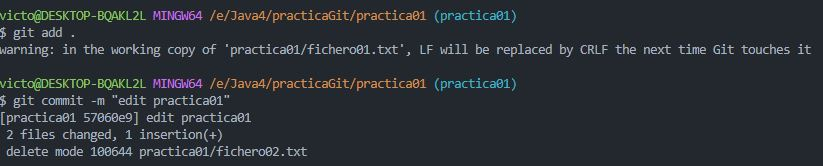
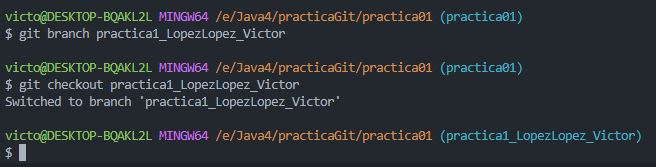

# Práctica
## Ejercicio de Git bash
1. Clona el repositorio https://github.com/DavidBernalGonzalez/practicaGit.git
2. Visualiza las distintas ramas que hay en el repositorio.   
    mediante el comando:   
    $ git branch -a    

3. Dentro del repositorio hay una carpeta llamada practica01, la encontrarás en la rama “practica01”. Sitúate en rama "practica01" para ver la carpeta practica01.
   
    
    
4. Sitúate en el directorio practica1 y edita los archivos a tu gusto. Una vez editados los ficheros, haz un git status para ver que ha pasado con los ficheros. Finalmente, haz un commit para subir los cambios al repositorio local  
   
    Entrar al directorio y editar los ficheros:  
    
    
      

    $ git status:  
      
    
    Commit de los cambios:

    

5. Crea una rama nueva, llámala practica1_APELLIDOS_NOMBRE
6. Muévete a la rama que has creado (practica1_APELLIDOS_NOMBRE)
   
      
    

7. En el directorio raíz, crea el fichero practica1_APELLIDOS_NOMBRE.txt y cualquier cosa en su interior. Y haz un commit de los cambios.  
    
    

8. ¡Nos hemos equivocado! Queremos que en el interior del fichero practica1_APELLIDOS_NOMBRE.txt tendremos que poner nuestro nombre y apellidos. Vuelve a hacer otro commit revirtiendo los cambios (haciendo un nuevo commit) y sube los cambios al repositorio remoto ¿Qué está pasando? ¿Cómo lo solucionarias? ¿Tienes los permisos para escribir en dicho repositorio? ¿Existe posibilidad de arreglarlo? 
    TIP: Elimina el remote actual y añade el de un remote de un repositorio nuevo en tu cuenta ya así si que tendrás permisos para escribirlo

    
    

    No es posible ya que no tenemos permisos para editar ese directorio, ya que no tenemos las credenciales.

9.  Vuelve a la rama “practica1”.
10. Haz un merge de tu rama (practica1_APELLIDOS_NOMBRE) con practica1
11. Añade dentro de la rama de tu carpeta todas los comandos que has utilizado. Puedes crear un documento por ejemplo de Word.
---
## Ejercicio de como trabajar con Git desde un IDE
Probablemente en tu proyecto te den libertad para usar el cliente git y el IDE que prefieras, por lo que está muy bien que te vayas acostumbrando a trabajar con alguno

1. Visual Studio Code: https://code.visualstudio.com/
2. Vamos a utilizar VSC para clonar el repositorio https://github.com/DavidBernalGonzalez/practicaGit.git
3. Abre el proyecto desde VSV e investiga sobre como realizar un commit, push, crear rama, “mergear”, borrar rama y resolver conflictos con los clientes.
